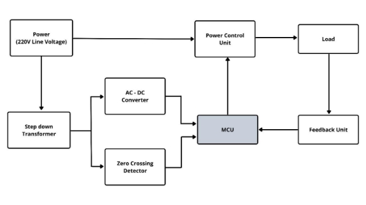
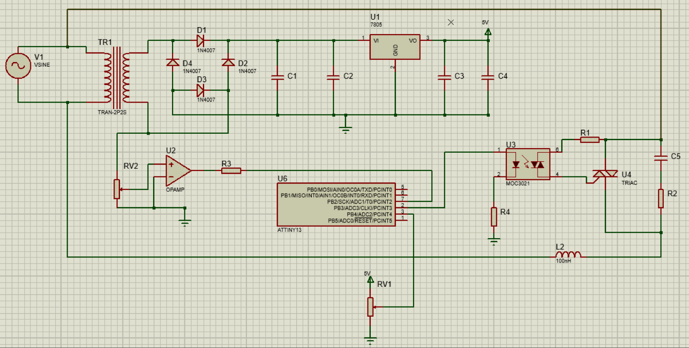



# HOT PLATE TEMPERATURE CONTROLLER

1. **Introduction** 

The Electric Hot Plates, a novel way to cook foods, have become a widely used technology in the culinary  industry.   The  Electric  Hot  Plate  market  has  witnessed  rapid  growth  ever  since  2017. Technological innovations and advancements have also further optimized the performance of these products, making them more widely used for mainstream applications.  

While being a popular method worldwide, hot plates have become more and more famous within Sri Lanka in the post-pandemic era. Due to the lack of other facilities at a reasonable price in the country, the population is leaning towards more alternative methods, including hot plates.  

The project’s objective is to build a temperature controller with PID using a microcontroller and power electronics.  In  this  method,  a  feedback  error  control  mechanism  is  used  to  give  the  sum  of  the proportional (P), integral (I), and differential (D) changing error value between the expected output and the current output. This output will be used to maintain the temperature of the hot plate at the required value.  

2. **Specifications** 

|**Input voltage** |**220/240V, 50/60Hz** |
| - | - |
|**Max output power** |2000W |
|**Temperature range** |50-300 C |

3. **Block Diagram** 

- A PID controller is used to control the temperature of the hot plate. 
- A microcontroller with power electronics is used for this implementation. 
- A zero-crossing detector is used to sync the control signal with the supply waveform.  

4. **Circuit Diagram** 

<pre>
Group Members
+-----------+----------------------+
|   Index   |         Name         |   
+-----------+----------------------+
|  190012X  | Abeysinghe A.L.R     | 
|  190014F  | Abeysinghe W.A.M.S.Y |
|  190018V  | Abeywickrama K.C.S.  | 
|  190021A  | Adikari A.M.A.D.     | 
+-----------+----------------------+
</pre>
